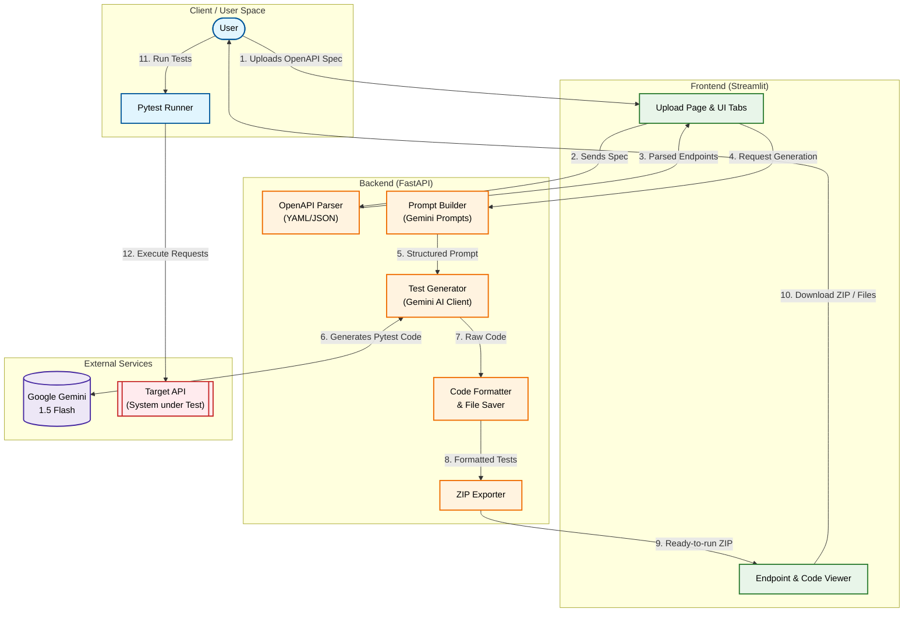

# ⚡ AI-Powered API Test Generator from OpenAPI

Automatically generate comprehensive **Pytest API test suites** from any OpenAPI/Swagger specification using **Google Gemini 1.5 Flash**.

---

## ✨ Features

| Feature | Details |
|---|---|
| **AI Test Generation** | Gemini 1.5 Flash generates positive, negative, boundary & type tests |
| **OpenAPI Support** | OpenAPI 3.0.x / 3.1.x in YAML or JSON |
| **Rich UI** | Modern Streamlit frontend with dark developer theme |
| **FastAPI Backend** | REST API with proper error handling and logging |
| **ZIP Export** | Download full test suite as a ready-to-run ZIP |
| **Per-file Downloads** | Download and preview individual test files |
| **Test Categories** | Positive · Negative · Boundary · Type · Status Code |

---

## 🏛️ Architecture

```
┌─────────────────────────────────────────────────────────┐
│                  Frontend (Streamlit)                   │
│    Upload Spec | Endpoints | Generate Tests | Download  │
└─────────────────────────────────────────────────────────┘
        │   │   │   │   │   │ REST API (JSON)
┌─────────────────────────────────────────────────────────┐
│                Backend (FastAPI + Python)               │
│   Parser | Prompt Builder | Formatter | Zip Exporter    │
└─────────────────────────────────────────────────────────┘
        │   │   │   │   │   │
┌─────────────────────────────────────────────────────────┐
│               AI Layer (Google Gemini API)              │
│       Gemini 1.5 Flash -> Code Generation & Retry       │
└─────────────────────────────────────────────────────────┘
```

### 📊 Detailed Component & Data Flow

Below is the detailed data flow showing how the OpenAPI specification is parsed, processed by Gemini, and exported:



---

## 🗂 Project Structure

```
api-test-generator/
│
├── frontend/
│   └── app.py                  # Streamlit UI
│
├── backend/
│   ├── __init__.py
│   ├── main.py                 # FastAPI application & routes
│   ├── parser.py               # OpenAPI YAML/JSON parser
│   ├── prompt_builder.py       # Gemini prompt engineering
│   ├── generator.py            # Gemini AI integration + retry
│   ├── formatter.py            # Code formatting & file saving
│   └── zip_exporter.py         # ZIP archive builder
│
├── generated_tests/            # Auto-generated test files (git-ignored)
├── uploads/                    # Uploaded spec files (git-ignored)
│
├── tests/
│   └── sample_bookstore_api.yaml  # Sample OpenAPI spec for testing
│
├── requirements.txt
├── .env.example
├── .gitignore
└── README.md
```

---

## 🚀 Quick Start

### 1. Clone & Setup

```bash
git clone https://github.com/your-org/api-test-generator.git
cd api-test-generator
```

### 2. Create a virtual environment (recommended)

```bash
python -m venv .venv

# macOS / Linux
source .venv/bin/activate

# Windows
.venv\Scripts\activate
```

### 3. Install dependencies

```bash
pip install -r requirements.txt
```

### 4. Configure environment variables

```bash
cp .env.example .env
```

Open `.env` and set your Gemini API key:

```env
GEMINI_API_KEY=your_gemini_api_key_here
API_BASE_URL=http://localhost:8000
```

> **Get a Gemini API key:** Visit [Google AI Studio](https://aistudio.google.com/app/apikey)

---

## ▶️ Running the Application

You need **two terminal windows** running simultaneously.

### Terminal 1 — Start the FastAPI Backend

```bash
uvicorn backend.main:app --reload --host 0.0.0.0 --port 8000
```

The backend API will be available at `http://localhost:8000`  
API docs (Swagger UI): `http://localhost:8000/docs`

### Terminal 2 — Start the Streamlit Frontend

```bash
streamlit run frontend/app.py
```

The UI will open automatically at `http://localhost:8501`

---

## 📋 Usage Guide

### Step 1 — Upload Spec
1. Open the Streamlit app at `http://localhost:8501`
2. Go to the **Upload Spec** tab
3. Upload your OpenAPI `.yaml`, `.yml`, or `.json` file
4. Click **Parse Specification**

### Step 2 — Review Endpoints
- Switch to the **Endpoints** tab
- See all parsed endpoints in a table view
- Click any endpoint to inspect details (parameters, request body, responses)

### Step 3 — Generate Tests
- Switch to the **Generate Tests** tab
- Click **Generate All Tests**
- Gemini 1.5 Flash will create tests for every endpoint
- Wait for completion (larger specs may take 1–2 minutes)

### Step 4 — Download
- Switch to the **Download** tab
- **Download ZIP** — full test suite in a ready-to-run package
- **Individual files** — preview and download per-endpoint test files

---

## 📦 Running Generated Tests

After downloading the ZIP:

```bash
# Extract the ZIP
unzip your_spec_tests_*.zip

# Install test dependencies
pip install pytest requests pytest-html

# Set your target API URL
export API_BASE_URL=http://your-api-host:port

# Run all tests
pytest tests/ -v

# Run with HTML report
pytest tests/ -v --html=report.html --self-contained-html

# Run only a specific endpoint's tests
pytest tests/test_createBook.py -v

# Run by test category (if markers used)
pytest tests/ -k "negative" -v
```

---

## 🔌 Backend API Reference

| Method | Endpoint | Description |
|---|---|---|
| GET | `/health` | Health check |
| POST | `/upload-spec` | Upload & parse an OpenAPI spec |
| POST | `/generate-tests` | Generate tests via Gemini AI |
| GET | `/download/{filename}` | Download a single test file |
| GET | `/download-zip/{spec_id}` | Download all tests as ZIP |
| GET | `/list-tests/{spec_id}` | List generated test files |

Full interactive docs: `http://localhost:8000/docs`

---

## 🧪 Sample Specification

A complete sample OpenAPI spec (`tests/sample_bookstore_api.yaml`) is included.  
It covers a **Bookstore API** with:
- `POST /auth/login` — JWT authentication
- `GET/POST /books` — List and create books
- `GET/PUT/PATCH/DELETE /books/{book_id}` — Book CRUD
- `GET/POST /authors` — List and create authors
- `GET/DELETE /authors/{author_id}` — Author operations
- Complex schemas with enums, constraints, and nested `$ref`

Use this to test the full pipeline immediately after setup.

---

## ⚙️ Configuration

| Variable | Default | Description |
|---|---|---|
| `GEMINI_API_KEY` | *required* | Google Gemini API key |
| `API_BASE_URL` | `http://localhost:8000` | Target API for generated tests |
| `BACKEND_HOST` | `localhost` | FastAPI host (Streamlit reference) |
| `BACKEND_PORT` | `8000` | FastAPI port |

---

## 🔧 Tech Stack

| Layer | Technology |
|---|---|
| Frontend | Streamlit 1.35+ |
| Backend | FastAPI 0.111+ |
| AI Model | Google Gemini 1.5 Flash |
| Parsing | PyYAML + Python `json` |
| Validation | Pydantic v2 |
| Data Display | Pandas |
| Testing Framework | Pytest |
| HTTP Client | Requests |
| Environment | python-dotenv |

---

## 🛠 Troubleshooting

**Backend shows "offline" in the Streamlit sidebar**
→ Ensure `uvicorn backend.main:app --reload` is running in a separate terminal.

**`GEMINI_API_KEY not found` error**
→ Create a `.env` file from `.env.example` and add your key.

**Parse error on upload**
→ Ensure your spec is valid OpenAPI 3.x. Test with the sample spec first.

**Generation times out**
→ Large specs (20+ endpoints) may take 2–3 minutes. The Streamlit timeout is set to 5 minutes.

**`ModuleNotFoundError: No module named 'backend'`**
→ Run commands from the project root directory (`api-test-generator/`).

---

## 📄 License

MIT — free to use, modify, and distribute.


## 🎥 Video Demo

Link : https://drive.google.com/drive/folders/1Q7V6FDpdXjyJYm_CSUoR5RzwndmhOuUZ?usp=sharing